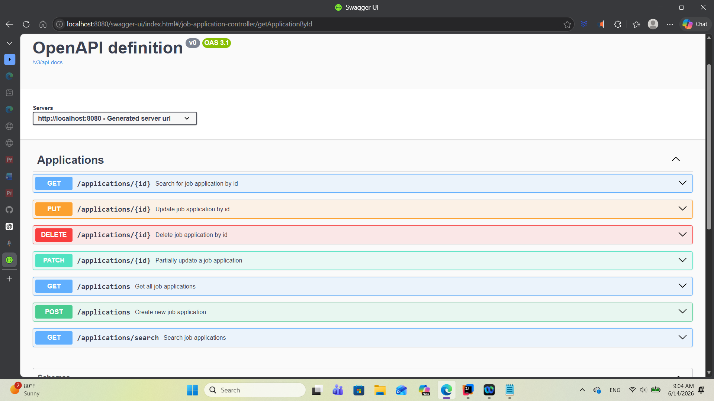
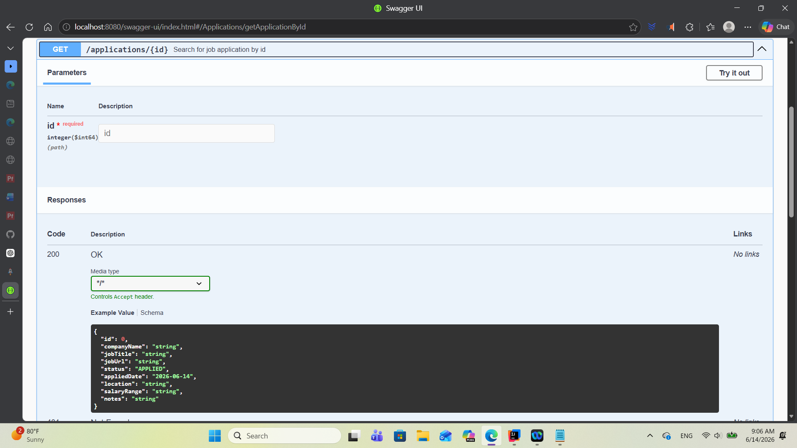

# Job Tracker API

A secure RESTful API for tracking job applications throughout the job search process.

The application allows users to register, authenticate using JWT, and securely manage their own job applications. It demonstrates modern backend development using Spring Boot, Spring Security, PostgreSQL, Flyway, Docker, automated testing, and cloud deployment. Boot, Spring Security with JWT authentication, REST APIs, Spring Data JPA, MySQL, Flyway database migrations, Docker, automated testing, and containerized deployment.

## Live Demo

Base URL

https://job-tracker-api-rw8t.onrender.com

Swagger UI

https://job-tracker-api-rw8t.onrender.com/swagger-ui/index.html

> The application is hosted on Render's free tier and may take 30–60 seconds to wake up after periods of inactivity.

## Features

- Create job applications
- View all applications with pagination
- Get application by ID
- Update applications
- Partially update applications
- Delete applications
- Search applications by company, location, and status using Spring Data JPA specifications
- Request validation
- Global exception handling
- Integration, controller, and service tests
- JWT Authentication (Register/Login)
- BCrypt Password Hashing
- User authorization (users can only access their own applications)
- Docker support
- Containerized deployment
- Swagger/OpenAPI documentation


## Tech Stack

- Java 17
- Spring Boot
- Spring Data JPA
- PostgreSQL
- H2 Database (testing)
- Flyway
- MapStruct
- Lombok
- JUnit 5
- Mockito
- MockMvc
- Swagger / OpenAPI
- Spring Security
- JWT
- Docker
- Docker Compose

## Key Backend Concepts Demonstrated

- RESTful API design
- Layered architecture (Controller → Service → Repository)
- DTO pattern with MapStruct
- JWT authentication and authorization
- Stateless security with Spring Security
- Password hashing with BCrypt
- Database persistence with Spring Data JPA
- Database versioning with Flyway migrations
- Request validation and global exception handling
- Pagination, sorting, and dynamic search using JPA Specifications
- Automated testing with JUnit 5, Mockito, and MockMvc
- Containerization with Docker and Docker Compose
- Cloud deployment on Render

## Architecture

```text
Client
   │
   ▼
Spring Security
   │
JWT Filter
   │
Controller
   │
Service
   │
Repository
   │
PostgreSQL
```
## Project Structure

```text
src
└── main
    ├── java
    │   └── com.paul.jobtrackerapi
    │       ├── config
    │       ├── controllers
    │       ├── dtos
    │       ├── entities
    │       ├── exceptions
    │       ├── mappers
    │       ├── repositories
    │       ├── security
    │       ├── services
    │       ├── specifications
    │       └── JobTrackerApiApplication.java
    └── resources
        ├── db
        │   └── migration
        └── application.yml
```

### Layer Responsibilities

- **Controller** - Handles HTTP requests and responses
- **Service** - Contains business logic
- **Repository** - Provides database access through Spring Data JPA
- **Database** - Stores job application information

## API Endpoints

| Method | Endpoint | Description |
|----------|----------|----------|
| POST | `/auth/register` | Register a new user |
| POST | `/auth/login` | Authenticate a user and return a JWT |

### Job Applications

| Method | Endpoint | Description |
|----------|----------|----------|
| POST | `/applications` | Create a job application |
| GET | `/applications` | Get all applications for the authenticated user |
| GET | `/applications/{id}` | Get an application by ID |
| PUT | `/applications/{id}` | Fully update an application |
| PATCH | `/applications/{id}` | Partially update an application |
| DELETE | `/applications/{id}` | Delete an application |
| GET | `/applications/search` | Search applications by company, location, and status |

### Analytics

- `GET /applications/analytics` — Returns application counts grouped by status for the authenticated user.

Example response:

```json
{
  "totalApplications": 4,
  "applied": 2,
  "phoneScreen": 1,
  "technicalInterview": 0,
  "finalInterview": 0,
  "offer": 0,
  "rejected": 1,
  "withdrawn": 0
}
```

## Authentication

This API uses JWT (JSON Web Token) authentication.

Users must first register or log in to receive a JWT access token.

```http
POST /auth/register
POST /auth/login
```

Include the JWT in the `Authorization` header when accessing protected endpoints:

```http
Authorization: Bearer <your-jwt-token>
```

Each authenticated user can only access and manage their own job applications.

## Security Features

- JWT Bearer authentication
- BCrypt password hashing
- Stateless authentication
- User-level authorization
- Protected REST endpoints

## Swagger UI

Interactive API documentation is available through Swagger/OpenAPI.

Access Swagger at:

```text
http://localhost:8080/swagger-ui.html
```

### API Overview



### Endpoint Details



## Search Examples

Search by company:

```http
GET /applications/search?companyName=Amazon
```

Search by location:

```http
GET /applications/search?location=New York
```

Search by status:

```http
GET /applications/search?status=APPLIED
```

## Example Create Request

```json
{
  "companyName": "Amazon",
  "jobTitle": "Backend Developer",
  "location": "New York"
}
```

## Example Response

```json
{
  "id": 1,
  "companyName": "Amazon",
  "jobTitle": "Backend Developer",
  "location": "New York",
  "status": "APPLIED"
}
```
## Validation Example

If invalid data is submitted, the API returns a structured error response.

```json
{
  "message": "Validation failed",
  "status": 400,
  "errors": {
    "companyName": "Company name is required"
  }
}
```

## Testing

The project contains 51 automated tests covering:

- Service tests
- Controller tests
- Integration tests

Test coverage includes:

- CRUD operations
- Authentication
- Authorization
- Validation
- Exception handling
- Search functionality
- Pagination
- Sorting

Integration tests run against an H2 in-memory database using a dedicated test profile.

## Running the Application

### Clone the repository

```bash
git clone <your-repository-url>
cd job-tracker-api
```

### Run with Docker (Recommended)

```bash
docker compose up --build
```

This starts both the Spring Boot application and a PostgreSQL database.

The API will be available at:

```text
http://localhost:8080
```

Swagger UI:

```text
http://localhost:8080/swagger-ui/index.html
```

### Run with Maven

If you already have PostgreSQL running locally, you can start the application without Docker:

```bash
./mvnw spring-boot:run
```


## Future Improvements

- Refresh token support for JWT authentication
- Role-based authorization (Admin/User roles)
- Job application analytics dashboard
- Email verification and password reset
- CI/CD pipeline with GitHub Actions
- Redis caching for frequently accessed data
- API rate limiting
- Resume and cover letter file uploads
